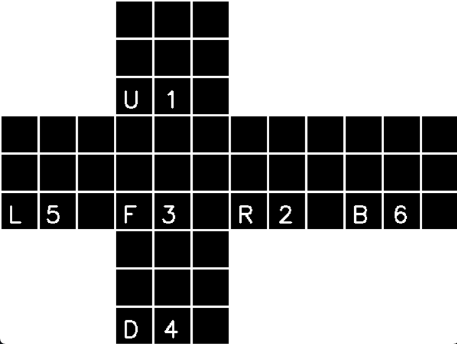
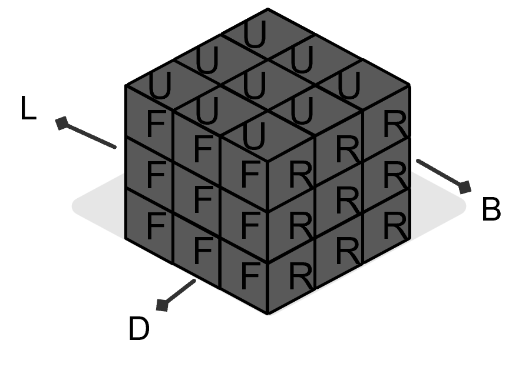

# Rubik's Cube Solver

We develop a Rubik’s cube solver that uses computer vision techniques to detect and analyze the colors on each face of the cube and then generate a sequence of moves to solve it. 

## Installation

[Python 3](https://www.python.org/) must be installed, and the following libraries are required:
* [NumPy](https://numpy.org/)
* [OpenCv](https://opencv.org/get-started/)
* [Kociemba](https://pypi.org/project/kociemba/)

## How to run

```
python3 main.py
```

## How to use

* Run the script, and it will initialize the camera to capture the Rubik's cube.

* Hold the Rubik's cube in front of the camera and click on a square of each color in the requested order using the mouse.

* Following that, ensure that each face is detected and highlighted in this **order** and **orientation**:

    
    

    1. Begin with any side facing the camera (U 1).
    2. Show the face on your **left** (R 2);
    3. Show the **front** face (F 3);
    4. Show the **bottom** face (D 4);
    5. Show the **right** face (L 5);
    6. Finally, show the **back** face (B 6).

* Once all six faces are detected, the solution will be displayed, and the steps to solve the Rubik's cube will be shown in real time. You have to show the F face in the orientation you showed before for the solution to be shown correctly. You must first show the F face in the correct orientation so that the solution is presented correctly.

* If you've done the steps above correctly, you should have your cube solved.

## Troubleshooting

* If the camera is not detected or the script encounters any issues, check the camera connection and make sure the required libraries are installed.

* If the cube is not detected and highlighted, you will probably need to re-run the calibration process or change the Lab color ranges in [main.py](main.py) in the *showPixelValue* function.